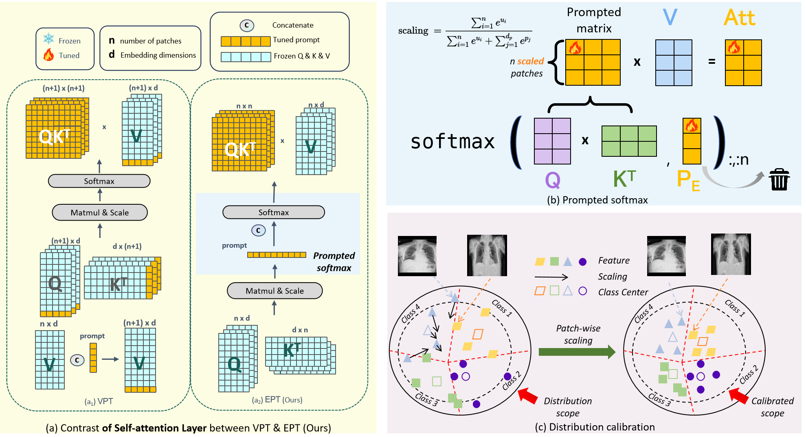

# EPT

Official Pytorch Code base for [Embedded prompt tuning: Towards enhanced calibration of pretrained models for medical images](https://arxiv.org/abs/2407.01003), Medical Image Analysis, AIFM


## Introduction

Foundation models pre-trained on large-scale data have been widely witnessed to achieve success in various natural imaging downstream tasks. Parameter-efficient fine-tuning (PEFT) methods aim to adapt foundation models to new domains by updating only a small portion of parameters in order to reduce computational overhead. However, the effectiveness of these PEFT methods, especially in cross-domain few-shot scenarios, e.g., medical image analysis, has not been fully explored. In this work, we facilitate the study of the performance of PEFT when adapting foundation models to medical image classification tasks. Furthermore, to alleviate the limitations of prompt introducing ways and approximation capabilities on Transformer architectures of mainstream prompt tuning methods, we propose the Embedded Prompt Tuning (EPT) method by embedding prompt tokens into the expanded channels. We also find that there are anomalies in the feature space distribution of foundation models during pre-training process, and prompt tuning can help mitigate this negative impact. To explain this phenomenon, we also introduce a novel perspective to understand prompt tuning: Prompt tuning is a distribution calibrator. And we support it by analyzing patch-wise scaling and feature separation operations contained in EPT. Our experiments show that EPT outperforms several state-of-the-art fine-tuning methods by a significant margin on few-shot medical image classification tasks, and completes the fine-tuning process within highly competitive time, indicating EPT is an effective PEFT method. 

<p align="center">
  
</p>


## Using the code:

The code is stable while using Python 3.10.11, CUDA >=10.1

- Clone this repository:

```bash
git clone https://github.com/zuwenqiang/EPT.git
cd EPT
```

Install requirements by:

```bash
$ conda install pytorch==1.8.0 torchvision==0.9.0 torchaudio==0.8.0 cudatoolkit=10.1 -c pytorch
$ pip install mmcls==0.25.0 openmim scipy scikit-learn ftfy regex tqdm
$ mim install mmcv-full==1.6.0
```

## Datasets

1) MedFMC - [Link](https://opendatalab.com/OpenDataLab/MedFMC)

## Data Format

Make sure to put the files as the following structure:

```
data/
├── MedFMC
│   ├── chest
│   │   ├── images
│   │   ├── chest_X-shot_train_expY.txt
│   │   ├── chest_X-shot_val_expY.txt
│   │   ├── train_20.txt
│   │   ├── val_20.txt
│   │   ├── trainval.txt
│   │   ├── test_WithLabel.txt
│   ├── colon
│   │   ├── images
│   │   ├── colon_X-shot_train_expY.txt
│   │   ├── colon_X-shot_val_expY.txt
│   │   ├── train_20.txt
│   │   ├── val_20.txt
│   │   ├── trainval.txt
│   │   ├── test_WithLabel.txt
│   ├── endo
│   │   ├── images
│   │   ├── endo_X-shot_train_expY.txt
│   │   ├── endo_X-shot_val_expY.txt
│   │   ├── train_20.txt
│   │   ├── val_20.txt
│   │   ├── trainval.txt
│   │   ├── test_WithLabel.txt
```

## Training and Validation

1. Train the model.

```
# you need to export path in terminal so the `custom_imports` in config would work
export PYTHONPATH=$PWD:$PYTHONPATH
# Training with EPT
# Choose a config file like `configs/vit-b16_ept/chest_1shot.py` to train its model
python tools/train.py $CONFIG
```

2. Evaluate.

```
# Evaluation
# Endo and ChestDR utilize mAP as metric
python tools/test.py $CONFIG $CHECKPOINT --metrics mAP
python tools/test.py $CONFIG $CHECKPOINT --metrics AUC_multilabel
# Colon utilizes accuracy as metric
python tools/test.py $CONFIG $CHECKPOINT --metrics accuracy --metric-options topk=1
python tools/test.py $CONFIG $CHECKPOINT --metrics AUC_multiclass
```

### Acknowledgements:

The repository is built upon [MedFM](https://github.com/openmedlab/MedFM). More details could be found at [MedFM](https://github.com/openmedlab/MedFM).

### Citation:

```
@article{zu2024embedded,
  title={Embedded prompt tuning: Towards enhanced calibration of pretrained models for medical images},
  author={Zu, Wenqiang and Xie, Shenghao and Zhao, Qing and Li, Guoqi and Ma, Lei},
  journal={Medical Image Analysis},
  pages={103258},
  year={2024},
  publisher={Elsevier}
}
```